# Zachry Leadership Program Reverse Scheduling Engine + Student Scheduling Software Suite

<p align="center">
  
</p>

<p align="center"><em>Built for the Zachry Leadership Program at Texas A&M's College of Engineering.</em></p>

> **Note:** This is deployed and used in production internally by the ZLP program, gated behind Texas A&M (`@tamu.edu`) Google authentication. Since it's restricted to TAMU accounts, there's no public link to share here. The writeup  below + the project description located on my personal website covers the system in detail instead.

> **Note 2:** This is a public copy of the repository. A few files that talk to live university data sources have had their implementation details removed (the utilized version in practice is kept in a separate private repository).

---

## The Problem

The [Zachry Leadership Program](http://engineering.tamu.edu/student-life/zachry-leadership-program/index.html) (ZLP) is a 2.5-year leadership program hosted by the Texas A&M College of Engineering, running 32 students across a diverse range of engineering majors per cohort. Once a week, every student in the cohort must attend a single mandatory 100-minute joint class session. Finding a time for that session sounds straightforward, but in practice, it's anything but.

Engineering degrees at Texas A&M are tightly structured. Many required courses across the 22 B.S. programs in the College of Engineering are offered in only one or two sections a semester at a fixed time, and most aren't offered again the following semester, i.e., missing one class can cause a student to reorganize an entire degree plan and potentially delay graduation. With 32 students spread across that many programs, nearly every slot on the weekly schedule is a genuine conflict for someone.

For nine years, the program director managed this with a manual spreadsheet. In particular, he proposed a time, asked each student a "yes/no" question if the time worked or not with no explanation required. A "no" meant the director had to track down the specific conflict by hand and figure out if any alternative existed for a student. When no workable meeting time could be found, the one or two students causing the fewest conflicts were pulled out to meet privately (undermining the entire point of a program built around a cohort growing together).

Three separate teams of graduate students attempted to solve this over that nine-year span. All three failed. Upon revisiting their attempts, they either failed by optimizing for student preference rather than checking whether a conflict-free schedule was even *possible*, or by building on unreliable data (bulk-scraping the university site instead of querying live enrollment, so any section that opened, closed, or moved times/dates before preregistration inadvertently broke the result).

## Why It's Hard

Each of the 32 students carries 4–6 courses a semester. The ZLP session must be exactly 100 minutes (a length that doesn't align with TAMU's standard 50/75-minute lecture blocks and can't simply drop into a natural schedule gap) and must start between 8:00 AM and 4:10 PM on a weekday to allow the program directors to spend time with their families in the evening.

Critically, a conflict isn't just a direct time overlap. A student can dodge a direct conflict by picking one course's section, only to have that choice eliminate every remaining section of a *different* required course — we deem this as a  *self-conflict*. Verifying true feasibility means evaluating every combination of available sections across every course a student is taking, for every possible 100-minute window in the week. This is a combinatorial **constraint satisfaction problem** where the search space grows with cohort size, program diversity in major selection, and section count. Brute force is not an option.

---

## The Algorithm

<p align="center">
  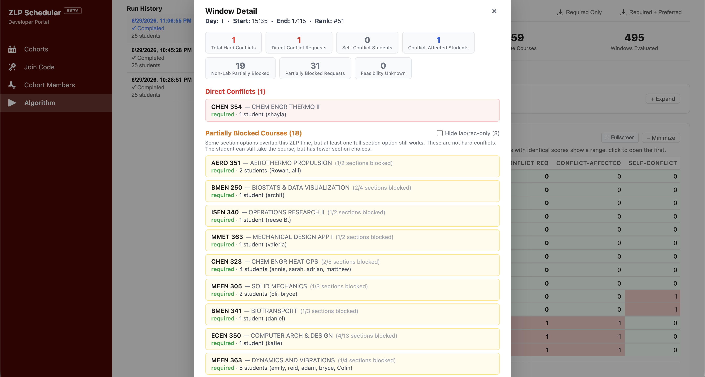
</p>
<p align="center"><em>One candidate window view: summary stats up top, then exactly which courses are blocked and which students are affected. So, a "bad" time is never an unknown, and a borderline one can be judged on further details if needed.</em></p>

`server/src/lib/zlpAlgorithm.js` sweeps every candidate window across the weekly grid in 5-minute increments. There are **495 candidate windows per run** as a byproduct of the aforementioned start time constraint.

**Search space reduction.** Before any search runs, sections of each course are collapsed into equivalence classes by meeting time pattern. In particular, two sections are equivalent if they share the same days, start time, and end time, regardless of instructor or room. A course with 8 sections but only 3 distinct time patterns branches 3 ways, not 8. Lab and recitation sections are treated as secondary constraints. The algorithm is set up so the search solves lecture combinations first with full *DFS backtracking*, then greedily attaches the first compatible lab/recitation rather than searching all lab combinations exhaustively, since lecture scheduling is where real conflicts concentrate.

**Per-student feasibility search.** For each candidate window, the algorithm runs a depth-first backtracking search per student, picking a section for one course at a time and backtracking on conflict, capped at **50,000 nodes/100ms per student**. This cap is a deliberate heuristic as students in large programs (e.g. Mechanical Engineering) have enough section options that a conflict-free schedule almost certainly exists regardless of the window, so exhausting the full search for them is wasted work. The cap is calibrated for students in small, constrained programs where a bad window can make a working schedule genuinely impossible. When the cap is hit, the system reports **"unknown feasibility"** rather than a false negative, preserving transparency in the output.

**Two evaluation modes.**
- **Required Only** — evaluates direct and self-conflicts using all available sections
- **Required + Preferred** — additionally treats each student's preferred section choices as hard constraints, giving a more realistic self-conflict picture for students who need or strongly want specific sections

A student never self-classifies a course as Required or Preferred to eliminate as many bad actors as possible. There exists a separate classification engine that checks each course against the student's actual degree program.

**Scoring.** Each window is scored on three metrics:
- **Direct conflicts**: windows that eliminate every available section of a required course
- **Self-conflicts**: students who can't construct *any* conflict-free schedule around the window, even with no single course fully blocked
- **Blocked requests**: windows that eliminate *some* but not all sections of a course, leaving the student technically able to take it but with reduced downstream flexibility (raising self-conflict risk)

A window with zero direct conflicts isn't automatically the right one for our program's meeting time. In fact, the last two semesters on a similar (but not as robust) version of this algorithm, we have **not** selected the most optimal time the scheduler outputs. For example, if half the cohort has heavily blocked requests, the director can see exactly where that pressure falls before committing to a time. Results export to a formatted Excel spreadsheet (via *ExcelJS*) with a green-to-red heatmap across the full weekly grid for a visually appealing and easily digestable output for the director to understand.

<p align="center">
  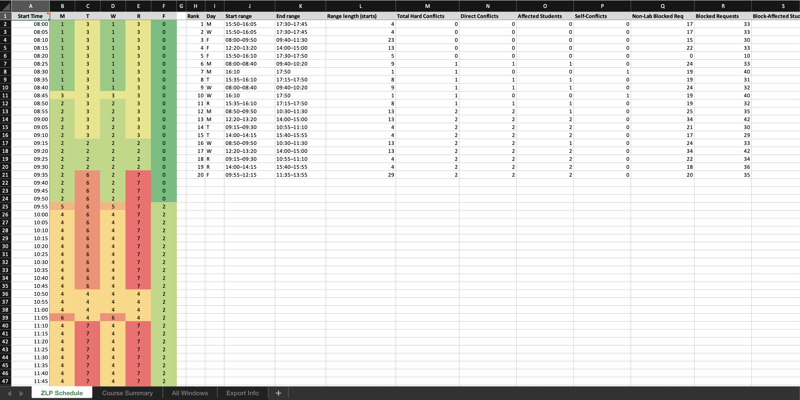
</p>
<p align="center"><em>The exported spreadsheet</em></p>

---

## Supporting Infrastructure

The algorithm is only useful if the data feeding it is trustworthy. Three components make that possible:

**Classification engine.** Automatically classifies each student's course requests as "Required" or "Preferred" relative to their declared program, driven by a directed requirement **graph** built per degree. The vertices are explicitly required courses their programs lists and open elective pools (credit-hour pools a student must satisfy from a set). The edges are prerequisite/corequisite dependencies. Supporting a new major means building its graph from catalog data, not writing new logic. Coverage spans every degree and minor offered university-wide, sourced from TAMU's public catalog. Admins can override an automated classification; the system keeps both the automated and final classification on record so the director always knows what they changed.

**Transcript parser.** Texas A&M doesn't grant third-party apps direct access to academic records (understandably), so the system reads a student's unofficial Howdy transcript **PDF** via PDF.js and extracts completed/in-progress coursework automatically. This is voluntary for a student to do. No student grades/GPA is stored in our database, and is only used to scrape the classes they have taken so they do not have to retype in all of the courses from their degree planner. Students are more than welcome to type everything in from scratch if they are uncomfortable. Retaken courses are deduplicated automatically, and each parsed course is cross-referenced against the catalog to backfill title and credit hours.

<p align="center">
  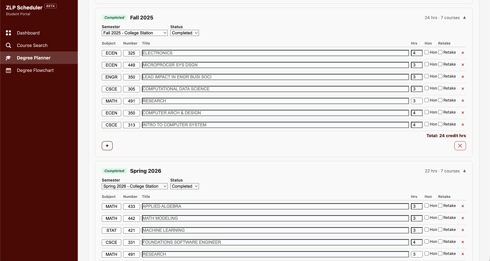
</p>
<p align="center"><em>The degree planner: coursework organized by semester, auto-populated from a parsed Howdy transcript and editable post upload. This record of completed/in-progress work is what feeds classification and the flowchart's status colors.</em></p>

**Interactive degree flowchart.** A **ReactFlow**-based flowchart for the program director, rendering a student's full degree requirements as a graph. Required courses and elective pools as vertices, prerequisite/corequisite relationships as edges, organized by semester the department expects you to take the class – obviously, most students do not follow this to a tee, but is used as a reference for pacing. Vertices are color-coded by status (green = completed, teal = in progress, white = not started). Clicking a vertex highlights its prerequisites in blue and its dependents in purple; pressing `A` expands the full transitive dependency chain; pressing `B` traces the **degree bottleneck**. The bottleneck of a degree program is the longest prerequisite chain in the degree, the sequence that actually constrains time-to-graduation. This gives the director instant orientation into any student's situation. This is quite useful for adjudicating a scheduling conflict or a classification override without needing to be in the loop in academic programs and contact a student's academic advisor.

<p align="center">
  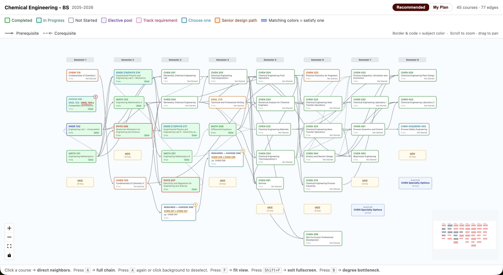
</p>
<p align="center"><em>A full Chemical Engineering B.S. degree organized by semester and color-coded by status.</em></p>

<p align="center">
  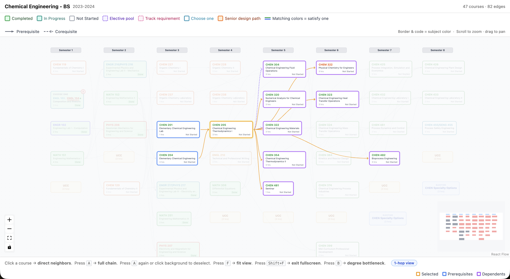
</p>
<p align="center"><em>Clicking CHEN 205 highlights its prerequisites (blue) and everything that depends on it (purple).</em></p>

<p align="center">
  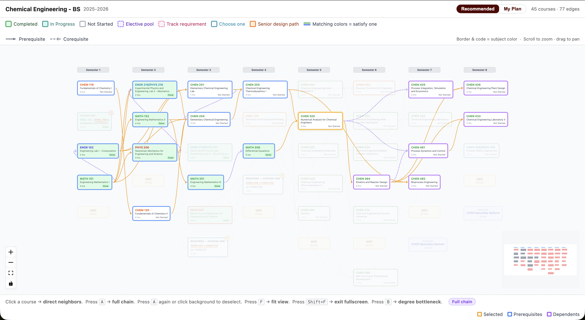
</p>
<p align="center"><em>Pressing <code>A</code> expands the full transitive chain. Here the image shows every course feeding in and out along the path through CHEN 320. Blue is everything upstream that has to be cleared to reach it, running back through CHEN 205 and CHEN 204 to the chemistry and math sequence in semester 1, and purple is everything downstream that it gates. This is why a course like CHEN 482 lights up even though CHEN 320 is nowhere in its prerequisite list: CHEN 482 needs CHEN 364, CHEN 364 needs CHEN 320, and the chain carries the dependency the whole way out.</em></p>

<p align="center">
  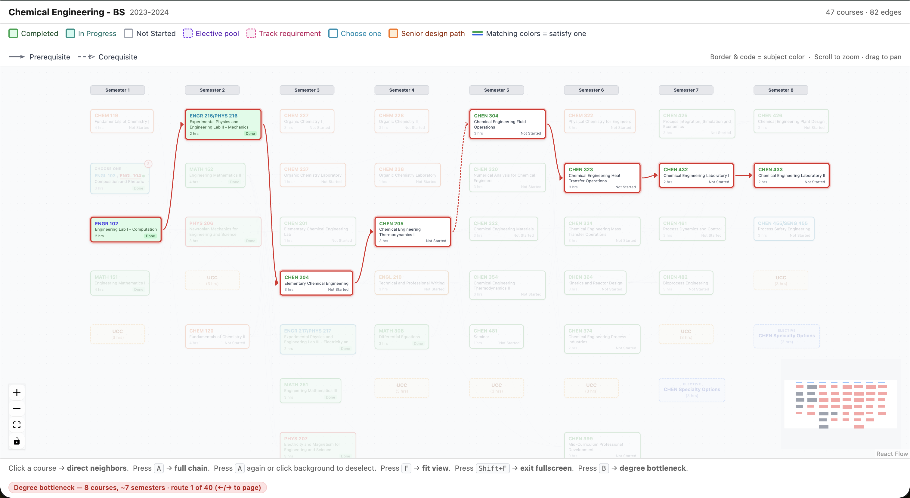
</p>
<p align="center"><em>Pressing <code>B</code> traces the degree bottleneck. Here an 8-course chain spanning ~7 semesters that gates graduation. There are 40 possible paths the DAG detects</em></p>

<p align="center">
  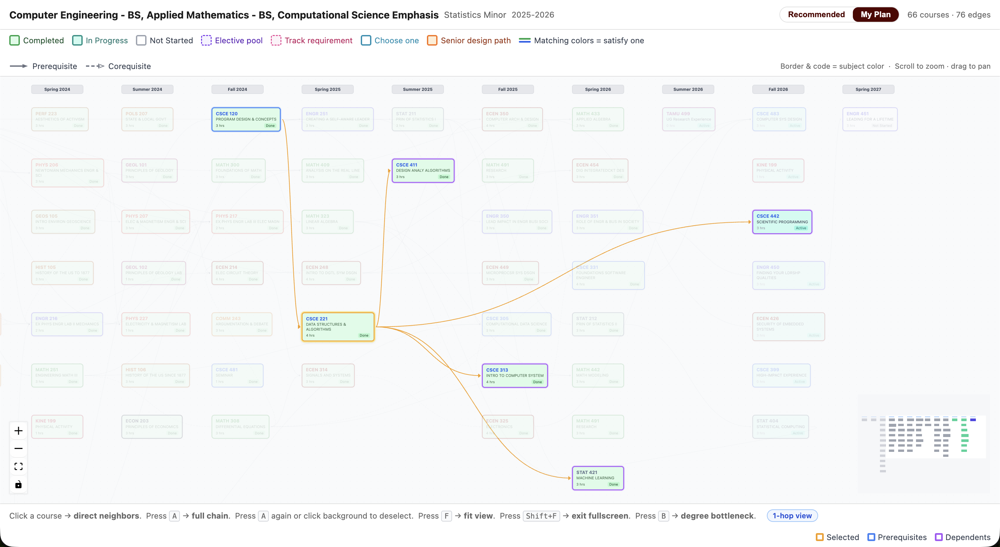
</p>
<p align="center"><em>My Plan shows the courses the student actually added in their degree planner, laid out by the semester they placed them in, for the student to toggle around with. The same click/<code>A</code>/<code>B</code> functionality holds as it does for Recommended. Recommended is built from the primary major alone, so it names just that; My Plan spans everything the student is enrolled in, so the header lists every major and then the minors.</em></p>

---

## Architecture & Tech Stack

A client-server app built on the **MERN stack** (MongoDB, Express, React, Node) in **JavaScript** end to end. The scheduling engine, requirement graphs, transcript parser, and live Howdy API integration all run server-side; a React/Vite frontend utilizes a **REST API** and surfaces everything through one interface for both the director and students.

```
ZLP_APP/
├── client/          Vite + React frontend (port 5173)
└── server/          Express + Node backend (port 3001)
    └── src/
        ├── models/  15 Mongoose schemas
        ├── routes/  Admin, student, and developer API routes
        └── lib/     Algorithm, classifier, degree graphs, course search, grade data
```

**API routes** are split by role, each namespaced under `/api`:
- `/api/auth`: Google OAuth login/logout/session
- `/api/admin/*`: cohorts, cycles, join codes, student review, algorithm runs, academic profile overrides
- `/api/student/*`: course search, requests, section preferences, degree plans, transcript import, submission
- `/api/degree-graph`, `/api/academic-programs`: shared read endpoints used by both portals
- `/api/developer/*`: dev-only tooling gated behind `ENABLE_DEV_VIEW_SWITCH`

**Authentication** is Google OAuth via Passport, backed by server-side sessions (`express-session` + `connect-mongo`) rather than client-stored tokens. Emails matching `ADMIN_EMAILS` land on the admin portal; other `@tamu.edu` accounts are students (who must join a cohort via a cohort's join code); non-`@tamu.edu` accounts are denied access to the software suite.

**Caching.** Two independent caching layers keep the app responsive without serving stale data:
- *Course sections* (`lib/courseSections.js`): a three-tier, per-term chain — in-memory → MongoDB (`TermSectionCache`) → a live Howdy fetch. Howdy returns the entire term unfiltered (~23 MB), and in a serverless deployment an in-memory cache alone is wiped on every cold start, so that fetch was repeating constantly. Persisting the mapped rows in MongoDB means the expensive fetch happens roughly once per term across all instances instead of once per instance. Raw fetches still use stale-while-revalidate, so an expired entry is served immediately while a refresh runs and the UI never blocks on a slow upstream request.
- *Degree requirement graphs* (`lib/degreeGraphBuilder.js`): a four-tier fallback chain ordered by speed. The order goes as follows: in-memory cache (10-minute TTL) → MongoDB → a pre-built static JSON snapshot → a live catalog scrape as last resort. This keeps classification fast and resilient even if the database or the university catalog is temporarily unreachable. The client caches the resolved graph too (5-minute TTL), since it is the heaviest fetch on the page and is shared by the flowchart and planner tabs, so switching between them does not re-hit the server.

---

## Some Other Features To Show

### Admin

<p align="center">
  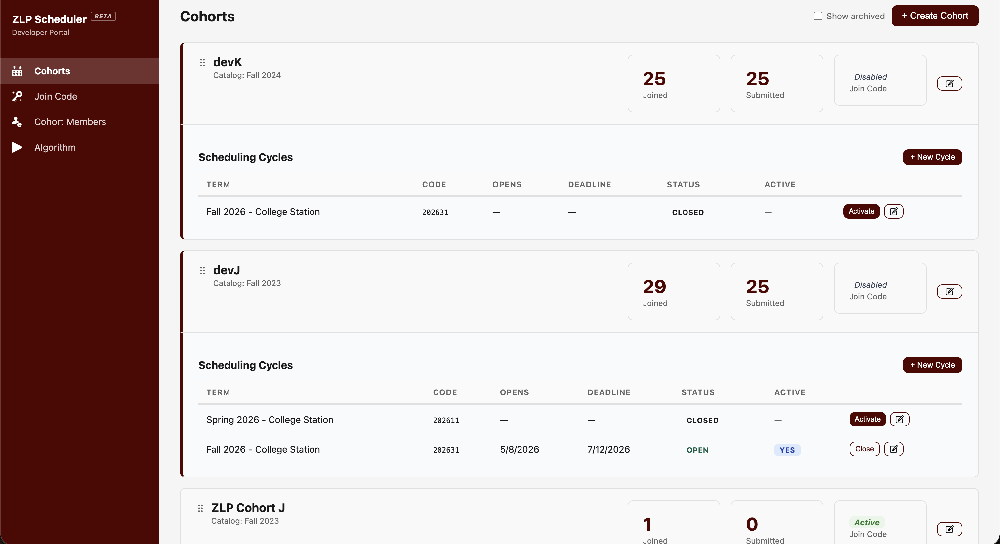
</p>
<p align="center"><em>The cohort dashboard (admin point of view)</em></p>


<p align="center">
  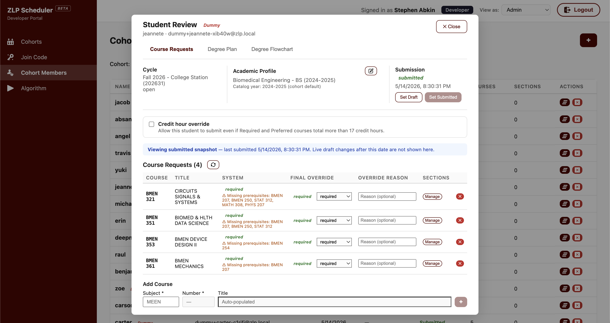
</p>
<p align="center"><em>Reviewing one student's submitted requests with the system's classification beside the final (overridable) one, a credit-hour override, and a banner that flags when the student has edited their draft since last submitting – those edits stay invisible here until they re-submit, so the director is never looking at half-changed data. The tabs across the top pull up that same student's degree plan and flowchart without leaving the modal.</em></p>


<p align="center">
  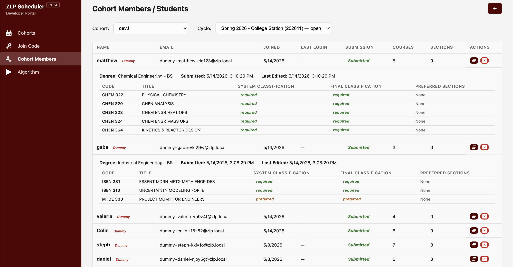
</p>
<p align="center"><em>Cohort members at a glance: submission status per student, expandable into each student's courses and classifications.</em></p>

### Student

<p align="center">
  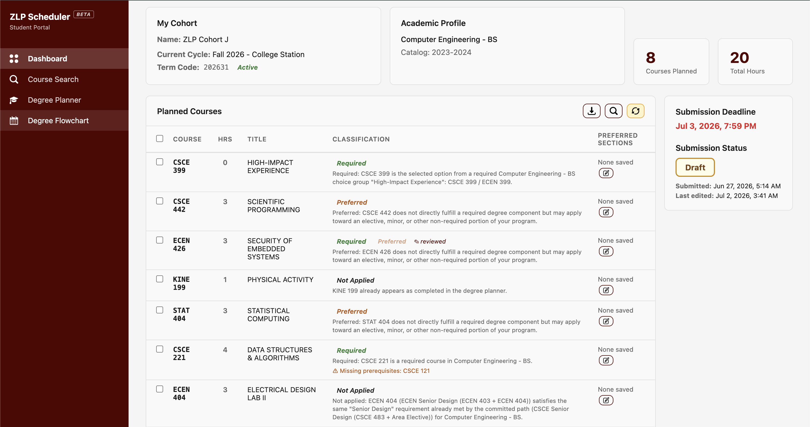
</p>
<p align="center"><em>The student dashboard: every planned course with its classification and an explanation of why it was classified that way, alongside the submission deadline and current status.</em></p>


<p align="center">
  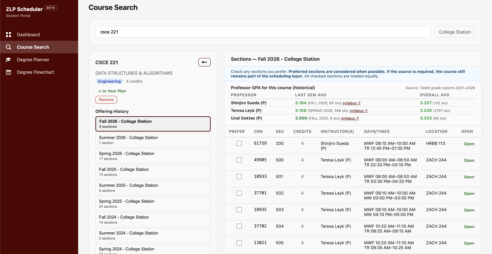
</p>
<p align="center"><em>Course search: live section data for the upcoming term (CRN, instructor, days/times, open status) with checkboxes to mark preferred sections, plus offering history and historical per-professor GPA to inform the choice.</em></p>


---

## How It's Configured

The app runs on Node 18+ against MongoDB, with a Vite/React client and an Express server split into the two workspaces described above. Everything that differs between a laptop and the production box is environment-driven, so no environment-specific values are baked into the code.

**Backend configuration.** The server reads its config from a handful of environment variables. The MongoDB connection string (`MONGO_URI`), the Google OAuth client credentials, a `SESSION_SECRET`, and the client/server base URLs used to build OAuth redirects and CORS origins. Two of these variables double as access control. `ADMIN_EMAILS` is the allowlist that decides which authenticated accounts land on the admin portal versus the student portal (the routing described in *Architecture & Tech Stack*), and `DEV_EMAILS` (paired with the `ENABLE_DEV_VIEW_SWITCH` flag) gates a developer-only "view as student" switcher that we used to test the student experience without a second account or having to constantly switch the classification of a user in the database during development. The frontend needs only one value, `VITE_API_BASE_URL`, pointing it at the server.

**OAuth redirect.** The one piece of OAuth that lives outside the code is the redirect URI, which has to be registered in Google Cloud Console and match whichever server URL is live. `http://localhost:3001/api/auth/google/callback` in development, the deployed server URL in production.

## How It's Deployed

The production instance runs against MongoDB Atlas, with `CLIENT_BASE_URL` and `SERVER_BASE_URL` set to the deployed origins and the Google OAuth redirect URI in Google Cloud Console updated to match the production server. Because access is entirely driven by `ADMIN_EMAILS` and the `@tamu.edu` domain check, onboarding a new program director is a config change (add their email) rather than a code change. 
